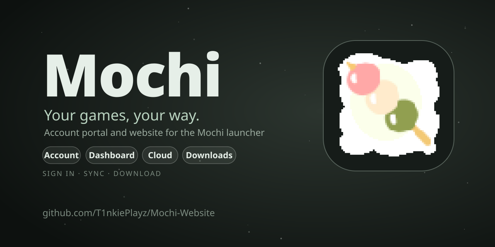

<p align="center">
  
</p>

<h1 align="center">Mochi Website</h1>

<p align="center">
  <strong>Your games, your way.</strong><br>
  The public site and signed-in account portal for the <a href="https://github.com/T1nkiePlayz/Mochi">Mochi game launcher</a>: documentation, downloads, and your account, sign-in methods and Mochi Cloud settings.
</p>

<p align="center">
  
  
  
  
  
</p>

<p align="center">
  
</p>

> [!NOTE]
> **This repository is the website only.** The desktop launcher (Linux and macOS, Steam Deck friendly, no Windows support) lives in [T1nkiePlayz/Mochi](https://github.com/T1nkiePlayz/Mochi). Live site: [mochi.ashtontink.com](https://mochi.ashtontink.com/).

## Table of contents

- [Overview](#overview)
- [Pages](#pages)
- [Account dashboard](#account-dashboard)
- [Setup](#setup)
- [Scripts](#scripts)
- [Supabase](#supabase)
- [Deployment](#deployment)
- [Documentation maintenance](#documentation-maintenance)
- [Security model](#security-model)
- [Contributing](#contributing)
- [License](#license)

## Overview

- **Explains Mochi**: features, how it works, download and install help, FAQ, roadmap, and a changelog read live from the launcher's GitHub releases.
- **Hosts the documentation** for the launcher: install, library, launching, mods, Big Picture, themes, accounts, cloud sync, development and reference.
- **Account portal**: one **Account** shared with the launcher, with sign-in methods, **Cloud sync**, **Service keys** and (for administrators) admin tools.
- **Hands sign-in to the app** through `mochi://auth/callback` when started from the launcher.

Words such as Piko, Tofu, Account, Cloud access, Cloud sync, Service key and Administrator are defined in [`CONTEXT.md`](CONTEXT.md). Use them in UI copy and docs.

Built with React 19, TypeScript, React Router (`HashRouter`), Vite 8, Tailwind CSS 4, `lucide-react`, Supabase (`@supabase/supabase-js`) and oxlint, and hosted on GitHub Pages.

## Pages

Routing is hash-based (`/#/...`) and defined in `src/App.tsx`. Heavy pages are lazy-loaded.

| Route | Page |
| --- | --- |
| `/` | Home |
| `/features`, `/how-it-works`, `/download` | What Mochi does, how it works, install options |
| `/documentation`, `/documentation/:section` | Documentation |
| `/roadmap`, `/changelog`, `/faq` | Roadmap, releases from GitHub, FAQ |
| `/signin`, `/auth/verify` | Sign in, second-step verification, email verification |
| `/dashboard`, `/settings`, `/admin` | The account dashboard, behind an access gate |

`public/policy/`, `public/terms/` and `public/auth/verify/` are static pages served as they are.

## Account dashboard

Code is in `src/dashboard/` and is loaded only after sign-in.

| Tab | What it does |
| --- | --- |
| **Overview** | Account summary and shortcuts. |
| **Account** | Profile, email, password, sessions (sign out everywhere), JSON export, account deletion. |
| **Security** | Sign-in methods overview, **Authenticator app**, **Passkeys**, **Linked accounts** (Google, GitHub), **Service keys**. |
| **Cloud** | **Cloud sync** switch (needs **Cloud access**), a searchable view of the synced library, clear cloud data. |
| **Admin** | Administrators only: stats, user directory, cloud access, sessions, bans, audit log. |

Sign-in methods: password, email code, Google, GitHub and passkeys. An account with an authenticator app is asked for a code after a password or email-code sign-in. A passkey sign-in counts as a complete sign-in by itself.

## Setup

Requires Node 20+ and npm.

```bash
git clone https://github.com/T1nkiePlayz/Mochi-Website.git
cd Mochi-Website
npm ci
cp .env.example .env.local   # add your own Supabase values
npm run dev
```

| Variable | Purpose |
| --- | --- |
| `VITE_SUPABASE_URL` | Your Supabase project URL |
| `VITE_SUPABASE_PUBLISHABLE_KEY` | The publishable (anon) key, safe for browsers |

Never put a `service_role` or other secret key in `.env.local` or any `VITE_*` variable: those ship to every visitor. Without the variables the site still builds, but account features are unavailable.

## Scripts

| Command | What it does |
| --- | --- |
| `npm run dev` | Vite dev server |
| `npm run build` | `tsc -b`, then `vite build` into `dist/` |
| `npm run lint` | oxlint |
| `npm run preview` | Serve the built site |
| `npm test` | Documentation anchor check, lint, then build (the same checks as CI) |

## Supabase

The website's migrations extend the launcher's database and are **not a standalone schema**. [`supabase/README.md`](supabase/README.md) lists the launcher migrations to apply first. Then apply these in order:

1. `20261006120500_website_profile_controls.sql`
2. `20261008140000_admin_tools_and_account_deletion.sql`
3. `20261009150000_security_hardening.sql`
4. `20261009160000_passkey_account_deletion.sql`

Migrations are forward-only: add new idempotent files and never edit one that has been applied.

In the Supabase dashboard, add every deployed site URL (for example `https://mochi.ashtontink.com/` and `https://t1nkieplayz.github.io/Mochi-Website/`), plus `mochi://auth/callback` and `mochi://auth/verify`, to **Auth > URL Configuration**. Passkeys need the WebAuthn relying-party ID to match the site's domain.

## Deployment

- `.github/workflows/deploy.yml` runs on pushes to `main`: `npm ci`, lint, build, then publishes `dist/` to GitHub Pages. The Supabase values come from the repository secrets `VITE_SUPABASE_URL` and `VITE_SUPABASE_PUBLISHABLE_KEY`.
- `.github/workflows/ci.yml` runs the anchor check, lint and build on pull requests and `main`.
- `vite.config.ts` uses `base: './'`, so one build works under a sub-path or a custom domain. Link with `import.meta.env.BASE_URL`, never a leading `/`.
- Auth redirects use the current origin plus path (`siteUrl()` in `src/lib/supabase.tsx`). The custom domain is set in GitHub Pages settings; no `CNAME` is committed.

## Documentation maintenance

Headings in `src/Documentation.tsx` are listed in a registry that must match the article sections. Run `node scripts/check-doc-anchors.mjs` (also part of `npm test`) after editing docs, and keep them in line with the launcher.

## Security model

The browser is not an authorization boundary. Role, ownership, AAL2 and confirmation checks are enforced in database functions and Row Level Security. Administrator actions need an administrator who has an authenticator app, and deleting an account needs a recent sign-in and the retyped email. Report vulnerabilities privately to support@ashtontink.com, not in a public issue.

## Contributing

See [CONTRIBUTING.md](CONTRIBUTING.md) for setup, checks and guidelines. Issues and pull requests use the templates in `.github/`, and everyone follows the [Code of Conduct](https://github.com/T1nkiePlayz/Mochi/blob/main/CODE_OF_CONDUCT.md).

## License

The website source is released under the [MIT License](LICENSE). The Mochi name, logo and artwork (including `public/mochi.png` and the social preview card) are not covered by it, and the Terms of Service and Privacy Policy text is specific to the Mochi service. The launcher is licensed separately under GPL-3.0-or-later.
